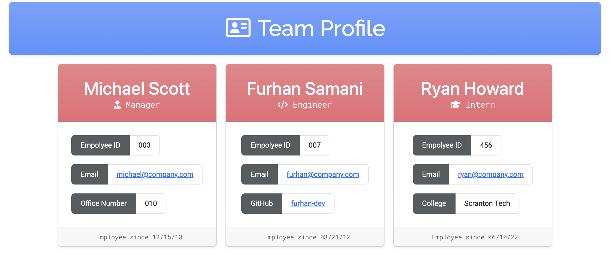

# Team Profile Generator

## Description
CLI app that creates a team profile as a HTML file. The profile consists of cards for each employee, which are generated based on input into the CLI app. The generated profile can be founnd in the `dist` directory.

## Table of Contents
* [Installation](#Installation)
* [Usage](#Usage)
* [Contribution](#Contribution)
* [Tests](#Tests)
* [License](#License)
* [Questions](#Questions)

## Installation
`npm i`

## Usage
`node index.js`

## Contribution
Fork this repo and create a pull request if you'd like to contribute to this project.

## Tests
`npm test`

## License
This project is covered under the MIT License

## Questions
* Email: [contact@furhan.dev](contact@furhan.dev)
* GitHub: [furhan-dev](https://github.com/furhan-dev)
* Video Demo: [Link to Google Drive](https://drive.google.com/file/d/1Ur5d2k5ClcGdDvTTv1AjCQpPHEnJLKgF/view)
